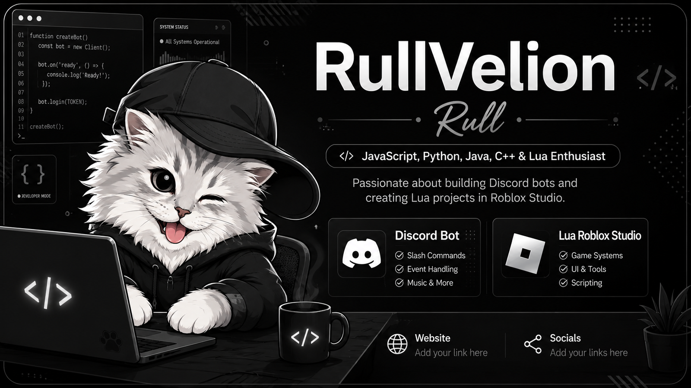
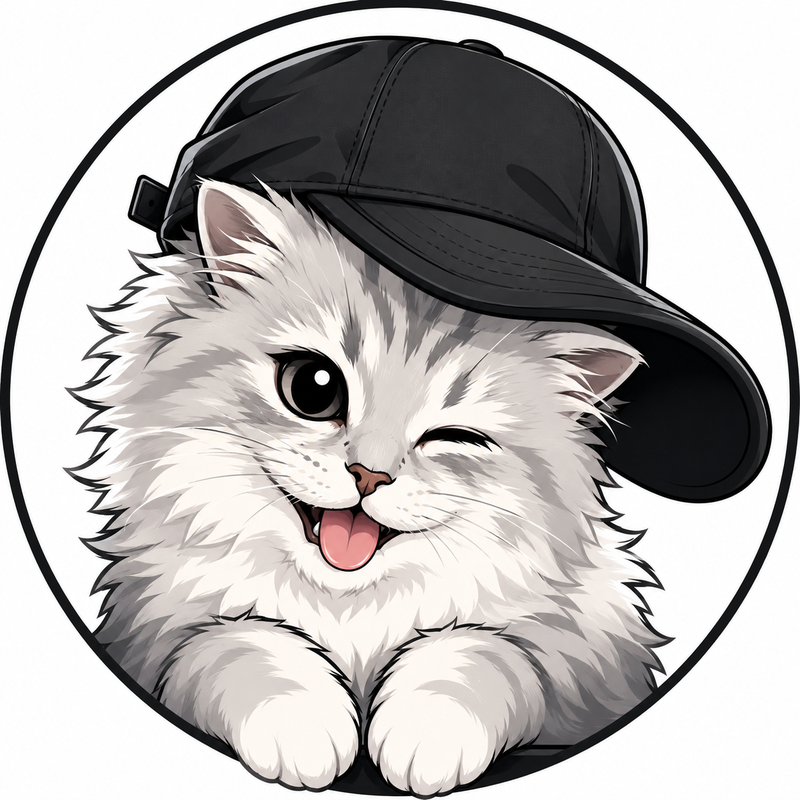
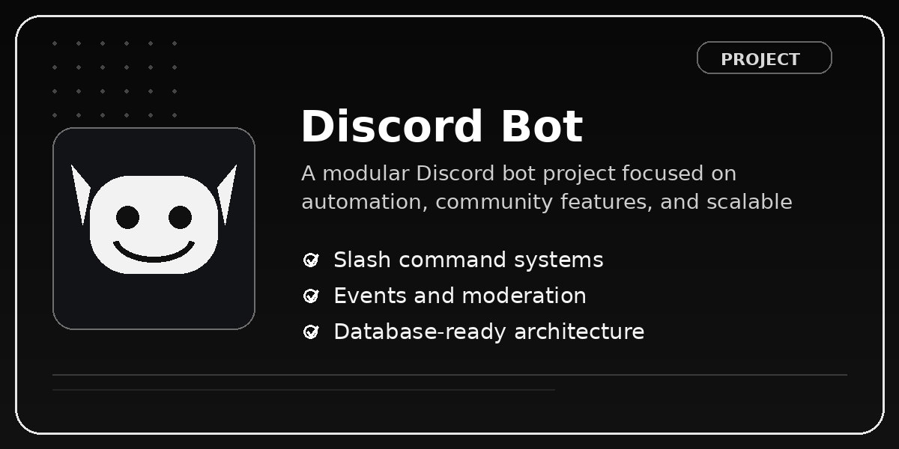
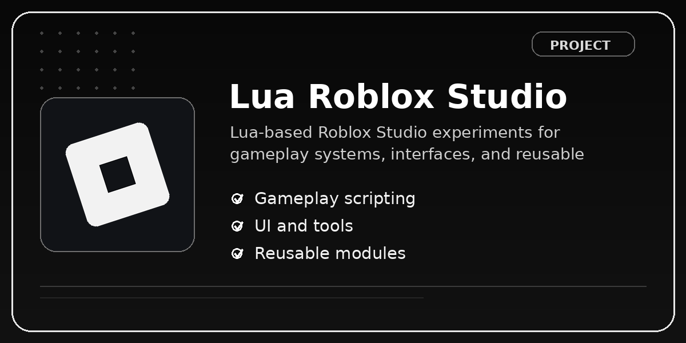

  

# Hello World, I'm RullVelion 👨‍💻

### JavaScript · Python · Java · C++ · Lua Enthusiast

I'm Rull, a curious developer who enjoys learning how software works and turning ideas into real projects.
My main interests are Discord bot development, automation, and Lua scripting in Roblox Studio.
I am currently expanding my skills across JavaScript, Python, Java, C++, and Lua.

 

## 👨‍💻 About Me

- 🤖 Interested in building useful and well-structured Discord bots.
- 🎮 Learning Lua scripting and game systems through Roblox Studio.
- 🧠 Exploring JavaScript, Python, Java, C++, and Lua.
- 🧩 I enjoy experimenting, solving problems, and improving projects step by step.
- 🚀 Currently focused on developing my coding portfolio and creating more public projects.

## 🛠️ Tech Stack

  

 

## 🚀 Featured Projects

> Project repository links can be added here after the repositories are created.

 

## 📊 GitHub Statistics

  

  

## 🌐 Connect With Me

- Discord: [RullVelion](https://discord.com/users/1472492310934585470)
- Website: `Replace this text with your future website`
- Social media: `Replace this text with your future social links`

 

### Thanks for visiting my profile! 🖤

